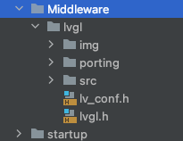
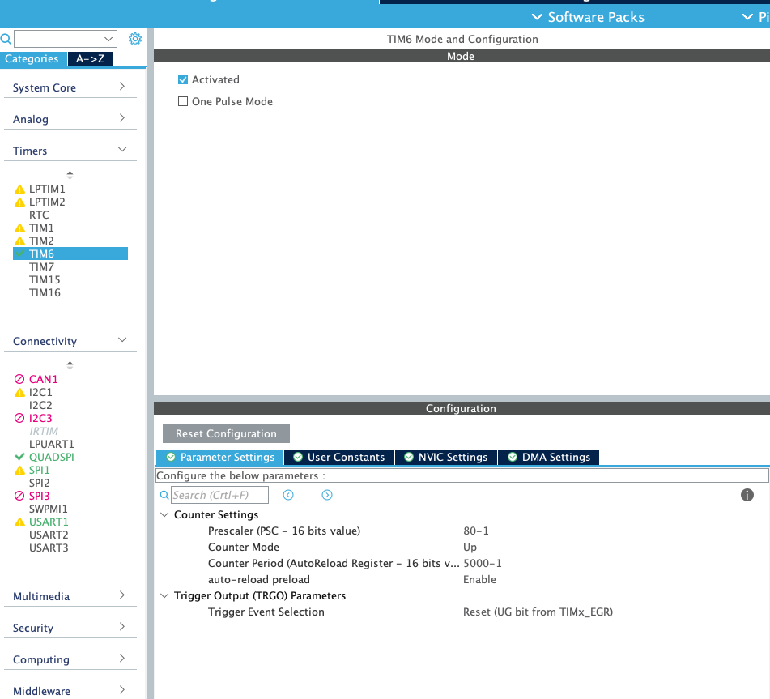

# 使用[OpenHandheld](https://www.eetree.cn/project/detail/6)制作一个时钟

## 实现目标

可设置时间、整点报时的模拟时钟

## 开发平台选择

STM32CubeMX6.1.1、CLion2020.3

## 设计思路

使用LVGL中间层来生成画面，使用SPI驱动LCD屏幕

## SPI-LCD驱动的编写

查看[原理图](https://qn.eetree.cn/FkBlR1XzQ87g8et4vWdLYr3foLeN?attname=openhandheld-mx.pdf)，在cubemx中选择对应的引脚


SPI的驱动主要参考[小熊派开发板](https://www.huaweicloud.com/theme/243690-1-X)的程序，由于我们使用CubeMx生成初始化代码，删除驱动里引脚初始化部分。驱动中需要被用到的函数大致为画点、显示图片等。

## LVGL图形库的使用

主要参考[链接](https://blog.csdn.net/qq_26106317/article/details/109666444)，移植LVGL到STM32平台，暂时使用裸机开发

1. 下载LVGL源码：

   使用git命令

   ```shell
   git clone https://github.com/lvgl/lvgl.git
   ```

2. 整理文件并复制到工程内，删除porting文件夹内文件和lv_conf_template文件的文件名后缀_template

   ​    

3. 使能文件

   在lv_conf.h/lv_port_disp.c/lv_port_disp.h文件中把#if 0改为#if 1

4. LVGL参数的修改

   LVGL的参数主要在lv_conf.h内

   修改如下

   修改屏幕分辨率

   ```c
   #define LV_HOR_RES_MAX          (240)
   #define LV_VER_RES_MAX          (240)
   ```

   开启颜色2字节转换

   ```c
   #define LV_COLOR_16_SWAP   1
   ```

   降低刷新率限制

   ```c
   #define LV_DISP_DEF_REFR_PERIOD      10      /*[ms]*/
   ```

   设置LVGL可用缓存，根据MCU内存来选择，这里使用的L431内存为64K，我使用48K作为显存

   ```c
   #  define LV_MEM_SIZE    (48U * 1024U)
   ```

   关闭LVGL_V6的支持

   ```c
   #define LV_USE_API_EXTENSION_V6  0
   ```

5. 显示api的对接

   显示api相关的函数主要在lv_port_disp文件内

   修改lv_port_disp_init函数

   选择合适的缓存方法，我这里选择例2。

   （这里我注释掉了第二个static的变量定义，这行代码使gcc报错重复定义，不知注释掉有何影响，暂未发现）

   ```c
   #define EXAMPLE 2
   
   #if (EXAMPLE == 1)
       /* Example for 1) */
       static lv_disp_buf_t draw_buf_dsc_1;
       static lv_color_t draw_buf_1[LV_HOR_RES_MAX * 10];                          /*A buffer for 10 rows*/
       lv_disp_buf_init(&draw_buf_dsc_1, draw_buf_1, NULL, LV_HOR_RES_MAX * 10);   /*Initialize the display buffer*/
   #elif (EXAMPLE == 2)
       /* Example for 2) */
       static lv_disp_buf_t draw_buf_dsc_2;
       static lv_color_t draw_buf_2_1[LV_HOR_RES_MAX * 10];                        /*A buffer for 10 rows*/
   //    static lv_color_t draw_buf_2_1[LV_HOR_RES_MAX * 10];                        /*An other buffer for 10 rows*/
       lv_disp_buf_init(&draw_buf_dsc_2, draw_buf_2_1, draw_buf_2_1,
                        LV_HOR_RES_MAX * 10);   /*Initialize the display buffer*/
   #elif (EXAMPLE == 3)
       /* Example for 3) */
       static lv_disp_buf_t draw_buf_dsc_3;
       static lv_color_t draw_buf_3_1[LV_HOR_RES_MAX * LV_VER_RES_MAX];            /*A screen sized buffer*/
       static lv_color_t draw_buf_3_1[LV_HOR_RES_MAX * LV_VER_RES_MAX];            /*An other screen sized buffer*/
       lv_disp_buf_init(&draw_buf_dsc_3, draw_buf_3_1, draw_buf_3_2, LV_HOR_RES_MAX * LV_VER_RES_MAX);   /*Initialize the display buffer*/
   #endif
   ```

   修改生成的分辨率

   ```c
       disp_drv.hor_res = LV_HOR_RES_MAX;
       disp_drv.ver_res = LV_VER_RES_MAX;
   ```

   设置缓存类型

   ```c
   #if (EXAMPLE == 1)
       disp_drv.buffer = &draw_buf_dsc_1;
   #elif (EXAMPLE == 2)
       disp_drv.buffer = &draw_buf_dsc_2;
   #elif (EXAMPLE == 3)
       disp_drv.buffer = &draw_buf_dsc_3;
   #endif
   ```

   修改disp_init函数，写入自己的LCD初始化函数

   ```c
   static void disp_init(void) {
       LCD_Init();
   }
   ```

   修改disp_flush函数，这个函数就是画图接口，我们暂时在这里使用最简单的画点

   ```c
      int32_t x;
      int32_t y;
      for(y = area->y1; y <= area->y2; y++) {
          for(x = area->x1; x <= area->x2; x++) {
              /* Put a pixel to the display. For example: */
              /* put_px(x, y, *color_p)*/
              LCD_Draw_ColorPoint(x,y,color_p->full);
              color_p++;
          }
      }
   ```

   最后在头文件中声明函数

   ```c
   void lv_port_disp_init(void)
   ```

6. 调用lvgl

   初始化

   在各种Init之后，while(1)之前初始化lvgl和显示设备初始化

   ```c
       lv_init();
       lv_port_disp_init();
   ```

   心跳

   LVGL需要每隔5ms（其实一般随意）进行一次心跳，调用以下两个函数

   ```c
   lv_tick_inc(tick);
   lv_task_handler();
   ```

   我这边使用定时器每5ms进中断后运行心跳，为避免LVGL任务函数时间过长影响中断，使用一个全局标志位

   

   定时时长 = 1 / (80M / 80 / 5000) = 0.005s

   ```c
   bool lvtick;
   /// 初始化时
   lvtick = false;
   /// while(1)中
   if (lvtick) {
       lv_tick_inc(5);
       lv_task_handler();
       lvtick = false;
   }
   /// 定时器中断回调
   void HAL_TIM_PeriodElapsedCallback(TIM_HandleTypeDef *htim) {
       lvtick = true;
   }
   ```

7. 添加时钟图片

   由于这块开发板并不像寒假在家一起练使用F103RB内存那么紧张，又有外置qspi的nor flash可用，可以不用用画圆等方式画时钟的外框，使用图片。这边暂时先将时钟和三个指针的图片放在内置flash中。


